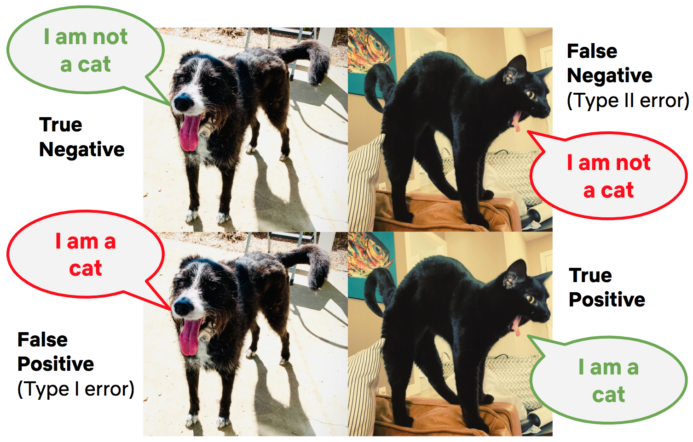
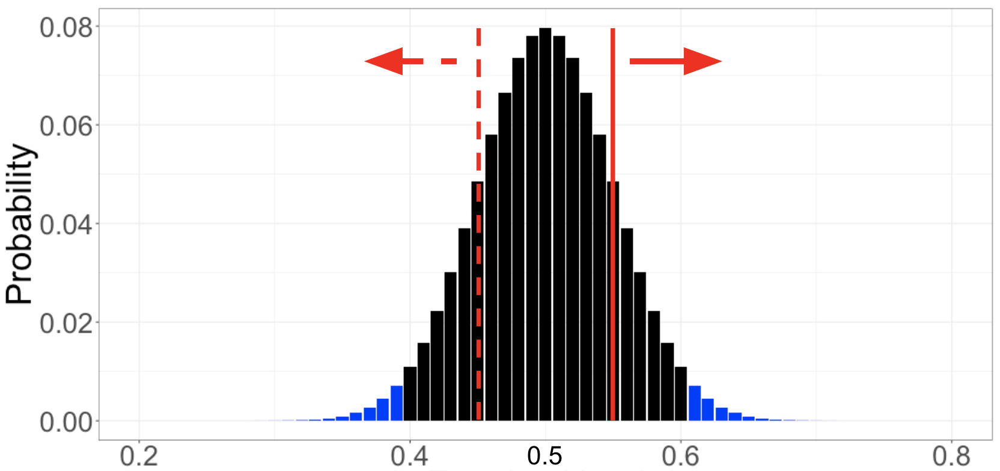
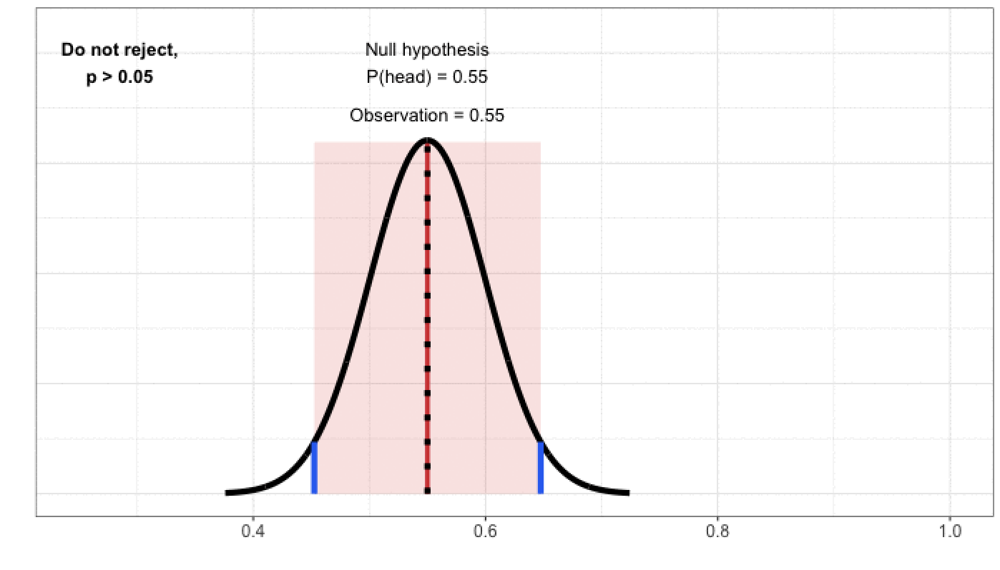

## A/B 테스트 결과 해석하기: 
원문 글: https://netflixtechblog.com/interpreting-a-b-test-results-false-positives-and-statistical-significance-c1522d0db27a

### 개요

최근에 인과 추론을 공부하면서 관련된 글을 찾아보게 되었습니다. 그러다 넷플릭스 테크 블로그에서 A/B 테스트 및 통계적 지식에 대한 글 시리즈의 내용이 너무 괜찮아 번역해 공유드립니다. 본 글은 4개의 글 중 3번째입니다. 첫 두 글은 introduction 및 A/B 테스트란 무엇인가에 대해 설명하는 기초적인 내용이라 건너뛰었습니다. 
본문은 서비스 테스팅과 관련된 통계적 개념을 직관적으로 이해하는 것에 초점을 두었기 때문에 복잡하고 머리 아플 수 있는 수학적 계산이 빠져있습니다. 그래서 오히려 진또배기 개념 자체에 더 집중하기 좋다는 생각이 듭니다.

### 본문

A/B 테스트 결과를 해석할 때 크게 두 가지 실수를 할 수 있습니다. 바로 Type I: **거짓 양성(false positive)**, 그리고 Type II: **거짓 음성(false negative)** 오류입니다. 거짓 양성은 인과 추론에서 우리가 예상한 대로 치료군(treatment group)에서 더 긍정적인 효과를 보였으나, 그 원인이 의도하지 않았던 다른 요인 때문인 경우입니다.
즉, 실제 treatment는 별 효과가 없었는데 다른 이유 때문에 효과가 있는 것처럼 보이는 실수입니다. 거짓 음성은 그와 반대로 treatment의 효과가 있었지만, 효과가 없다고 잘못 판단하는 실수입니다.

위 오류에 대해 더 직관적으로 알아보기 위해 고양이 사진을 구별하는 인공지능의 예시를 보겠습니다. 주어진 이미지에 대해 시스템은 두 가지 결정("고양이" 또는 "고양이 아님")을 내리게 되고, 마찬가지로 이미지에 대한 팩트 역시 "고양이" 또는 "고양이 아님"입니다. 이는 아래 *그림 1*과 같이 총 네 개의 가능성으로 이어집니다.  
A/B 테스트도 마찬가지입니다. 실험을 통해 관찰한 데이터를 기반으로 내릴 수 있는 판단도 두 가지(treatment가 유의미한 영향을 미쳤거나 아니거나)이고, 실제로 그 실험이 효과가 있었는지에 대한 사실 역시 두 가지입니다.

그림 1

1종 오류 및 2종 오류에 대한 한 가지 중요한 사실은, 서로 반대이기 때문에 둘 다 완전히 없애는 것이 불가능하다는 것입니다. 1종 오류가 적어지도록 실험 설계를 하면 필연적으로 2종 오류의 비율이 올라갈 수밖에 없습니다. 이 글에서는 동전 던지기 예시를 통해 1종 오류(거짓 양성)와 관련된 통계적 개념에 대한 얘기를 할 것입니다. 

### 거짓 양성, 및 통계적 유의성

테스트를 진행할 때, 가설 및 1차 결정 지표에 대한 정리가 되었으면 통계적인 측면을 고려해야 합니다. 이 프로세스는 보통 허용 가능한 거짓 양성 허용 비율(acceptable false positive rate)을 설정하는 것으로 시작합니다. 이 비율은 통상적으로 5%인데, 이는 곧 치료군과 대조군의 유의미한 차이가 실제로 없을 때 5%의 확률로 통계적 유의성(statistical significance)이 존재한다고 판단할 수 있다는 말입니다. 즉, 100번 중 5번의 꼴로 우리는 실제로 냥이가 아닌 사진을 보고 이것은 냥이 사진이라는 결론을 내리게 됩니다. 이를 우리는 **유의수준(significance level) 5%로 유의하다**라고 정의합니다. 

유의수준은 p-value와 밀접한 관계가 있습니다. p-value란 치료군과 대조군의 차이가 없다고 가정할 때, 실험을 통해 얻은 결과와 같거나 더 극단적인 경우가 일어날 확률을 의미합니다. 간단한 확률 게임을 통해 p-value에 대해 좀 더 직관적으로 알아보겠습니다.

동전이 공평하지 않은지, 즉 앞면이 나올 확률이 50%가 아닌지 확인하고 싶다는 가정을 해봅시다. 아주 단순한 시나리오처럼 보이지만 실제로 A/B 테스트를 통해 새로운 제품 경험(예를 들어 새로운 UI 기능을 클릭하는 것 부터 넷플릭스 서비스를 한 달 더 유지하는 것)이 사용자의 행동에 미치는 영향을 알아보는 경우와 매우 유사합니다. 

위 가정을 검증하기 위해 동전을 100번 던진 후 앞면이 나오는 비율을 계산합니다. 동전이 완벽하게 공평하더라도 무작위성(또는 "노이즈")으로 인해 아마 정확히 50:50이 나오지는 않을 것입니다. 그런데 50에서 ± 몇 번까지 가 허용되는 범위인지 애매합니다. 언제 동전이 공평하다는 전제를 기각할 수 있는 충분한 증거가 쌓이나요? 만약 앞면의 비율이 100번 중 60이라면 동전은 공평하지 않다고 할 수 있나요? 이런 부분을 확실하게 정리해 주는 어떤 기준이 필요합니다.

직관적으로 알아보기 위해 한번 실험을 해보도록 하겠습니다. 먼저, 동전이 공평하다는 가정을 해봅시다 - 이것이 *현상 유지*, 또는 일반적인 사실로 받아들여지는 **귀무 가설**이 됩니다. 그리고 위 가설과 대립되는 설득력 있는 증거를 데이터로부터 찾아야 합니다. 설득력 있는 증거를 만들기 위해선 먼저 *귀무 가설이 참이라는 전제하에* 관찰 가능한 모든 결과에 대한 확률을 계산합니다. 즉, 이번 예시에서는 공평한 동전을 100번 던졌을 때 앞면이 0번 나올 확률, 1번 나올 확률, 2번 ... 100번 나올 확률을 수학적으로 계산하는 것이죠. 계산한 결과는 아래 그림 2와 같습니다.

그림 2

그다음 위 분포를 실험을 통해 수집한 데이터와 비교해 보는 것입니다. 그림 2의 빨간 실선이 위치한 것처럼 55%의 경우에 앞면이 나왔다고 가정해 봅시다. 이를 동전이 공평하지 않다는 가설의 *설득력 있는 증거*로 사용하기 위해서 **앞면의 확률이 55%보다 가능성이 낮은 모든 확률**의 합을 구해야 합니다. 이번 예시에서는 동전의 앞면이 나올 확률이 55% 이상인 경우를 전부 더하게 됩니다. 즉, 빨간 실선 오른쪽의 경우가 나올 확률입니다. 

귀무 가설이 참이라는 전제하에 관찰한 값보다 더 극단적인 결과가 나올 확률. 위 확률의 합을 바로 **p-value**라고 합니다. 여기서 귀무 가설은 동전이 공평하다는 것, 관찰 결과는 100번 중 55번의 경우 앞면이 나왔다는 것, 그리고 p-value는 0.32 정도입니다. 이 내용을 다른 말로 해석해 보면 *공평한 동전 100번 던지기 실험을 수차례 반복했을 때*, 전체 실험 횟수 중 앞면(또는 뒷면: 귀무 가설에 의해)이 55번 이상 나올 확률은 32%가 되는 것입니다.

동전이 공평하지 않다는 사실, 또는 새로운 고객 경험이 현재보다 낫다는 사실을 통계적으로 증명하기 위해 p-value를 어떻게 쓸 수 있을까요? 처음에 얘기했던 내용으로 다시 돌아가 만약 **p-value가 유의 수준 5% 보다 작다면** 통계적으로 유의한 효과가 있다는 결론을 내립니다. 즉, 실험의 관찰 결과가 발생할 가능성이 충분히 낮다면 귀무 가설을 공식적으로 버릴 수 있는 것입니다. 공평한 동전을 100번 던져서 앞면이 55번 나오는 경우의 p-value는 0.32입니다. p-value가 유의수준 0.05보다 크기 때문에 "동전이 공평하지 않다"라는 가정에 대해 통계적으로 유의미한 증거가 없다고 결론을 내리게 됩니다.

실험 또는 A/B 테스트에서 내릴 수 있는 결론은 총 두 가지: "효과가 있다(동전이 공평하지 않다)" 또는 "효과가 있다는 증거가 충분하지 않다"입니다. 재판에서의 "무죄" 또는 "증거 불충분"과 비슷하죠 - 증거 불충분과 결백은 아주 다릅니다. 마찬가지로, A/B 테스트에서 이러한 접근 방식은 "효과가 없다"라는 결론을 허락하지 않습니다. 단지 귀무 가설을 기각할 만큼 충분한 증거가 없다고 결론지을 뿐입니다. 위의 예시에서 동전을 100번 던졌을 때 앞면이 55%인 경우에는 **공평하지 않다고 할만한 근거가 충분하지 않다**라고 결론지었습니다. 결코 동전이 공평하다고 결론지은 것이 아닙니다. 만약 100번이 아니라 1000번 던졌다면 동전이 공평하다는 가설을 뒤집을 증거가 나왔을 수도 있기 때문입니다.

### 기각역과 신뢰 구간
A/B 테스트에서 p-value와 밀접하게 연관되어 있는 두 가지 추가적인 개념이 있습니다. 바로 **기각역**(rejection region)과 **신뢰 구간**(confidence interval)입니다. 

기각역은 **귀무 가설을 기각시킬 수 있는 값의 집합**입니다. 기각역을 계산하기 위해선 먼저 귀무 가설이 참이라 가정합니다. 그리고 기각 영역을 "관찰될 확률의 합이 0.05 보다 적은, 가능성이 가장 낮은 결과의 집합"이라 정의합니다. 즉, 기각역은 가설이 맞다는 전제하에, 해당 가설에 반대되는 증거가 가장 강력한 결과의 구성입니다. 그래서 실험의 결과가 이 영역에 속하면 귀무 가설을 기각하기에 통계적으로 유의미한 증거가 있다는 결론을 내립니다. 위 동전 실험에서의 기각역은 앞면이 나올 확률이 60% 이상, 또는 40% 이하인 경우(그림 2의 파란 부분)입니다. 기각역과 p-value의 관계는: 관찰된 결과가 기각역 안에 떨어지는 경우에만 p-value가 0.05보다 작다는 것입니다. 

현재까지의 접근 방식은 먼저 귀무 가설을 세우고, 가능한 결과 집합을 정의한 후 실험 결과를 비교하는 순서였습니다. 하지만 신뢰구간에 대해 이해하기 위해서는 먼저 관찰 결과에 집중하는 것이 편합니다. 그다음 "거짓 양성 허용 비율이 5%일 때 어떤 값이 관찰되어야 귀무 가설이 기각되지 않을까?" 한번 생각해 보는 것입니다. 동전 던지기에서 앞면의 비율이 55%였을 때 가설을 기각하지 않았고, 아마 60% 일 때도 마찬가지입니다. 그림 3이 보여주듯 45%에서 65% 정도는 귀무 가설이 기각되지 않는 범위입니다.

그림 3

이 범위를 "신뢰 구간"이라 부르고, 5% 유의 수준이라 미리 정했기 때문에 *신뢰 수준은 95%*가 됩니다. 다른 말로 풀어보면: 실험을 여러 번 반복했을 때, 95%의 경우 신뢰 구간 내에 실제 값(동전 앞면이 나올 실제 확률)이 들어간다는 뜻입니다. 신뢰 구간과 p-value의 관계는: 95% 신뢰구간은 p-value가 0.05보다 작은 경우에만 실제 평균값을 포함하지 않고, 이 경우에 귀무 가설을 기각합니다.

### 마무리

동전 던지기를 이용한 가상 실험을 통해 거짓 양성 오류, 통계적 유의성, p-value, 기각역 및 신뢰 구간에 대해 얘기해 보았습니다. 단순한 예시였지만 이 개념은 치료군과 대조군을 이용한 A/B 테스트에 똑같이 적용되는 핵심적인 개념입니다. 아마 여기서의 귀무 가설은 "경험 B는 구성원 만족도에 영향을 미치지 않는다"가 되겠지요. 그다음 위에서 했던 것과 똑같이 해보는 것입니다: 구성원 만족도에 차이가 없다는 전제 아래 A 그룹과 B 그룹의 차이에 대한 결과값 및 관련된 확률을 계산합니다. 그리고 실제 관찰 결과를 이 확률 분포와 비교해 p-value를 얻고 귀무 가설에 대한 결론을 내릴 수 있습니다. 마찬가지로, 기각역을 정의하고 신뢰구간을 계산할 수도 있습니다.

실험에서의 목표는 올바른 결정을 내리기 위해 불확실성에 대해 더 잘 이해하고 정량화하는 것입니다. 많은 경우 A/B 테스트의 결과는 미묘한 해석의 차이로 달라질 수 있으며, 테스팅은 의사 결정을 위한 한 가지 툴일뿐입니다. 
이 글을 통해 조금이라도 A/B 테스트의 기저에 깔려있는 통계적인 개념을 이해하는 데에 도움이 되었기를 바랍니다.