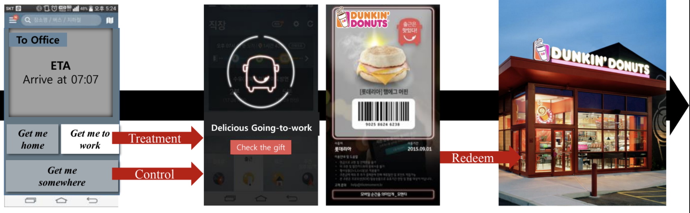

## 출근시간 타켓 마케팅의 인과적 효과 분석 사례

처음 데이터를 시작했을 때부터 관심 있던 분야가 있었습니다. 바로 ‘의사결정’에 대한 부분인데, 좋은 기회로 PAP를 통해 인과추론에 대한 스터디를 진행하였습니다. 
[인과추론의 데이터 과학](https://www.youtube.com/channel/UCkEHnPq2T8Vpafk3p-Rk49A) 유튜브 채널을 통해 공부를 하였는데, 인상 깊게 봤던 연구 사례를 정리해 공유드립니다.  
인과추론에는 크게 두 가지 접근 방식: 'design-based approach'와 'structure-based approach'가 있습니다. 오늘은 그중 design-based approach에 대한 사례를 가져왔는데, 이는 적절한 연구 설계를 통해 인과추론에 방해가 되는 요인을 최대한 제거하는 접근입니다. 위 방식에서 어떤 치료의 인과적 효과는, 해당 치료를 받았을 때의 결과와 만약 그 치료를 받지 않았다면 얻었을 잠재적인 결과의 차이로 계산합니다. 하지만 **counterfactual**이라고도 부르는 '잠재적인 결과'는 현실에서 관찰할 수 없는 부분입니다. 이미 치료를 받았는데 시간을 되돌려 치료를 받지 않게 만드는 것이 불가능하기 때문입니다. 그래서 현실에서는 '대조군(control group)'이 이를 대체하게 됩니다. 
결국 design-based approach에서는, counterfactual에 최대한 가까운 control group을 찾기 위해 실험을 얼마나 잘 디자인하였는지가 인과 추론의 퀄리티를 결정하는 요인입니다. 

그런 의미에서 본 글에서는 실험 결과나 해석보다 *실험을 설계한 방식*에 더 초점을 맞춰서 읽어보시면 좋을 것 같다는 생각이 듭니다.

### 연구 배경

본 사례는 모바일 쿠폰(기프티콘 등)에 대해 2015년에 진행한 실험을 토대로 2019년에 작성된 연구입니다. 당시 상당히 대중화된 스마트폰과 모바일 쿠폰에 비해 쿠폰을 실물로 교환하는 비율(2~15%)이 너무 낮다는 것에 대한 문제 제기로 시작되었습니다. 연구자들이 추정하는 그 이유는 쿠폰을 전달하는 매개체만 단순히 종이에서 모바일로 바뀌었을 뿐 스마트폰의 다양한 특징은 제대로 살리지 못하고 있기 때문이라고 판단했습니다.

여기서 말하는 스마트폰의 중요한 특징은 아래와 같습니다.
1. 항상 들고 다닌다: 원하는 시간에 쿠폰 전달 가능(temporal aspect)
2. 위치 정보 습득이 가능하다: 장소를 고려해서 쿠폰 전달 가능(geographical aspect)
위 두 정보를 결합하면 특정 상황을 이용한 문맥(context) 타게팅이 가능합니다.  

오늘 알아볼 context는 바로 **통근**입니다. 이는 굉장히 보편적이며 전 세계적으로 발생하는 행위입니다. 또 이 context에서 사람들은 평균적으로 매일 1시간 정도를 소비하고, 상위 3%는 무려 3시간이나 소비합니다. 그리고 무엇보다 출퇴근하는 사람들 중 무려 90%가 스마트폰을 사용한다는 사실입니다. 모바일 쿠폰에 대한 연구이기 때문에 context에 있는 대상자가 얼마나 스마트폰을 사용하는지는 매우 중요한 지표입니다. 
즉, 본 연구는 "통근이라는 context가 과연 모바일 쿠폰 사용률에 영향을 미치는가?"에 대한 연구입니다. 

지금까지 출퇴근과 연관된 연구 분야는 대부분 스트레스에 관한 것이었습니다. 기존 연구에 의하면 통근은 만성 스트레스를 유발하고, 만성 스트레스는 생리학적으로 식욕을 증가시키며 심리학적으로는 스스로 통제 가능한 범위에서 충동적인 행위를 야기한다고 합니다. 즉 '통근러'를 대상으로 식음료 기프티콘을 준다면 (아래 사진에서 보이는 논리로) 반응률이 더 높을 수도 있다는 추측에서 실험을 설계하게 되었습니다.

### 실험
실험의 디자인을 간단히 설명하면 모바일 쿠폰을 출퇴근 context에 있는 사용자와 그 외 사용자에게 랜덤하게 나누어 준 후, 그 두 그룹 간의 실제 교환율을 비교하는 방식입니다.

실험은 일반적인 대중교통 길찾기 앱을 이용해 진행되었습니다. 해당 앱에서는 집과 회사 주소를 등록해 출퇴근 경로와 그 외 경로 찾기에 대한 UI를 구분해놓았습니다. 그래서 '집으로 길찾기' 또는 '회사로 길찾기'를 선택하면 그 사람이 통근이라는 context에 있다는 것이 명확해집니다. 즉, 본 실험에서 치료군은 '집으로' 또는 '회사로' 버튼을 누른 사용자이고, 자연스럽게 대조군은 그 외 길찾기를 한 사용자가 됩니다.   

실험에 참가하는 참가하는 사용자가 겪게 되는 흐름은 아래 그림과 같습니다.

실험을 위해 5종류로 구성된 총 15,000개 정도의 쿠폰을 10,000명의 사용자에게 랜덤하게 나누어주었습니다. 사용자에 따라 두 개 이상의 쿠폰을 받은 경우도 있는데, 이를 이용해 총 두 가지 분석을 진행할 수 있습니다: 
1. 한 개의 쿠폰만 받은 사용자에 대해 *통근할 때 쿠폰을 받았는지, 또는 그 외 경우에 쿠폰을 받았는지*에 따라 쿠폰 사용률을 비교하기 위한 분석
2. 두 개 이상의 쿠폰을 받은 사용자에 대해 *인당 몇 개의 쿠폰을, 쿠폰의 기한은 얼마나 주는 것*이 효과적인지 보기 위한 분석

본 실험의 종속변수는 *쿠폰을 사용했는지 또는 사용하지 않았는지*, 독립변수는 *사용자가 출퇴근 context에서 쿠폰을 받았는지 또는 그 외 context에서 쿠폰을 받았는지*입니다. 그래서 나머지 쿠폰 전달 시간대, 요일, 상품 종류, 쿠폰 만료일, 사용자의 앱 사용 빈도 등은 최대한 일정하게 유지해야 하는 '통제변수'입니다.  
하지만, 분명 랜덤하게 나누어줬다 하더라도 통근러와 비통근러의 특징 때문에 사용자의 구성 또는 시간대와 같은 디테일이 다를 수 있습니다. 그래서 '성향 점수 매칭' 기법을 통해 치료군과 대조군의 특징을 최대한 맞춰주었습니다. 매칭 기법이란 연구 대상의 balance를 맞춰주는 작업을 의미합니다. 통근하는 집단 중 특정 사람과 그렇지 않은 집단의 특정 사람 중 앱 사용 빈도, 사용 시간대, 요일과 같은 통제변수의 특징이 비슷한 사람끼리 묶어 비교를 하는 것입니다. 이를 통해 독립변수에 따른 인과관계를 더 확실하게 추론할 수 있게 됩니다. 

### 결과
한 개의 쿠폰만 받은 사용자를 분석한 결과, 예상대로 출퇴근 context에 쿠폰을 받은 경우 그렇지 않은 사용자에 비해 쿠폰 사용률이 2~3배 정도로 높아 유의미한 차이가 있다는 것을 확인하였습니다.  
두 개 이상의 쿠폰을 받은 사용자를 분석한 결과, 여러 장의 쿠폰을 나누어줌으로써 사용률을 높이려는 시도는 통근러보다 그 외 context에 있는 사용자에게 더 효과가 좋은 것을 확인하였습니다. 즉, 통근 context에서는 여러 장의 쿠폰을 주더라도 교환율이 크게 변하지 않았지만, 그 외 context에서는 쿠폰을 많이 줄수록 교환율이 높았습니다.
또 출퇴근 context에서는 쿠폰 만료일이 가까웠을 때 사용률이 높고, 그 외 context에서는 반대로 기한이 많이 남았을 때 사용률이 높다는 것을 확인하였습니다. 

그런데 이런 결과에 대해 확실하게 짚고 넘어가야 하는 부분이 있습니다. 실험을 통해 증명하고자 하는 것은 "통근하는 context에 있는 사용자가 그렇지 않은 사용자보다 쿠폰에 대한 반응률이 높고, 그 원인은 통근러가 그렇지 않은 사람들에 비해 스트레스가 많기 때문"입니다.  
하지만 통근할 때와 그 외의 경우에 구조적으로 경험하는 이벤트가 다르기 때문에 쿠폰의 사용률에 영향을 미칠 수도 있다는 반문을 제기할 수도 있습니다. 아래 그림과 같이 출퇴근을 하는 경우에는 Event A와 같은 일을 계속해서 겪을 수 있고, 그 외 사용자들은 Event B를 누적해서 겪을 수 있다는 말입니다. 출퇴근을 위해 대중교통을 이용하는 사람과 데이트를 가기 위해 대중교통을 이용하는 사람이 그 사이에 겪는 일들은 확실히 다를 수 있다는 말이죠. 그런 일련의 event가 누적되어 사용률에 영향을 미치는 것이 아닌가?라는 반문입니다. 

위의 시나리오에서는 **쿠폰을 받은 시점부터 교환하기까지의 시간이 길어질수록** 경험하는 일련의 이벤트가 누적됩니다. 그리고 논리대로라면 그 event의 효과가 크게 발생할 것입니다. 즉, 쿠폰을 받자마자 교환하는 사람들 대비 쿠폰을 받고 시간이 흐른 후에 교환하는 사람들의 사용률이 더 높아야 합니다. 하지만 추가적인 분석을 진행한 결과 그렇지 않다는 것을 확인하였습니다. 쿠폰을 받자마자 교환한 경우는 사용률이 높았는데 오히려 기간이 늘어날수록 점점 사용률이 낮아졌습니다. 시나리오와 반대로 흘러갔기 때문에 위와 같은 반문을 reject할 근거를 확보한 것입니다. 

이로써 결론적으로 처음 연구자가 추측한 통근 스트레스와 모바일 쿠폰 사용률의 인과관계가 증명이 되었습니다.

### 마무리
Design-based approach에서 특정 치료의 인과적인 효과를 잠재적인 결과의 차이로 정의하는 관점을 **potential outcomes framework**라고 합니다. 본 글에서는 실제 인과추론 연구 사례를 통해 potential outcomes framework에서 실험을 설계하고 결론짓는 과정을 보았습니다. 이론적인 부분을 공부하면서 실제로 인과추론이 어떻게 활용되는지 궁금하셨던 분들에게 이런 내용이 조금이나마 도움이 되기를 바랍니다.

---

### References
Ghose, A., Kwon, H.E., Lee, D. and Oh, W., 2019. Seizing the Commuting Moment: Contextual Targeting based on Mobile Transportation Apps. Information Systems Research, 30(1), pp.154-174.

https://www.youtube.com/watch?v=LBpmqRs_JCI
